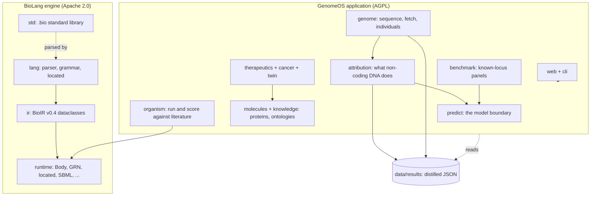
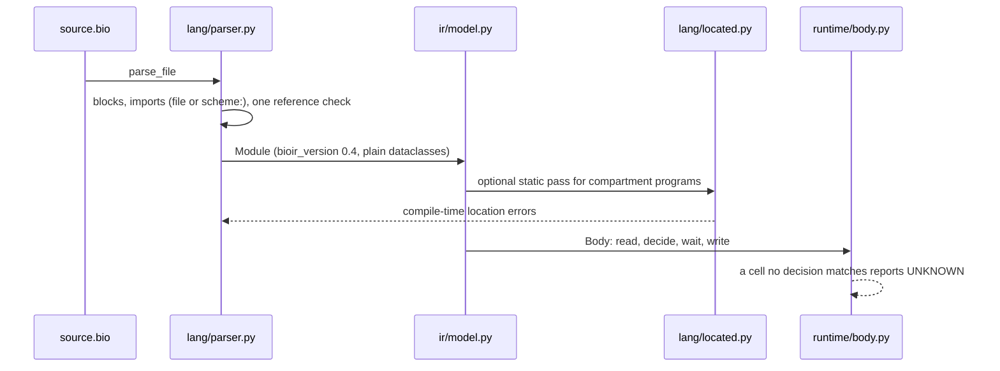

# Codebase map

A guide to where things are and why they sit where they do. It describes the
code at commit `9a40c18`; `data/` and `docs/` are named but not described.
For what the project is for, read [README.md](../README.md); for why the code
is shaped this way, [ARCHITECTURE.md](ARCHITECTURE.md) and
[DECISIONS.md](DECISIONS.md).

Measured at that commit: `genomeos/` 222 files and about 991k tokens,
`tests/` 180 files and 316k, `scripts/` 107 files and 246k, `docs/` 33 files
and 422k. `data/` holds 741 tracked files, mostly distilled results. The
`genomeos/` and `docs/` figures each exclude two files too large for the
counter: `cli.py` and `web/static/index.html`, `ATTRIBUTION.md` and
`ROADMAP.md`.

## The one rule that shapes everything

**The application may import the engine. The engine may never import the
application.**

That was an architectural rule before it was a licensing one. Since
2026-09-11 the engine is Apache 2.0 and the application is
AGPL-3.0-or-later, so an engine file importing an application module would
be a work based on AGPL code and could not honestly be distributed as
Apache. [tests/test_engine_boundary.py](../tests/test_engine_boundary.py)
parses the AST of every engine file and fails loudly, not with a warning.
[scripts/package_engine.py](../scripts/package_engine.py) goes further: it
repackages the engine subtree alone and proves it runs and self-tests with
no GenomeOS and no site-packages present.

| Half | Paths | Licence |
|---|---|---|
| BioLang engine | `genomeos/lang`, `ir`, `runtime`, `std`, `coords.py`, `version.py`, `bio.py` | Apache 2.0 |
| GenomeOS application | everything else under `genomeos/`, plus `scripts/` and `tests/` | AGPL-3.0-or-later |

Two console entry points follow the same line: `bio` is the engine
toolchain and works standalone; `genomeos` is the application.

## System overview



## Directory structure

```
genomeos/
  coords.py results.py version.py   the three things everything may import
  cli.py bio.py                     two entry points, two licences
  lang/ ir/ runtime/ std/           the engine
  genome/                           sequence, fetch, per-person genomes
  attribution/                      the largest package: what non-coding DNA does
  predict/                          the AlphaGenome boundary
  knowledge/ molecules/ lib/        ontologies, proteins, the BioLib catalogue
  organism/ benchmark/              run programs, score against literature
  cancer/ therapeutics/ twin/       the applications
  flow/ forge/ web/
scripts/    107 standalone runners; nothing imports them
tests/      180 files, no conftest.py
data/       reference, knowledge caches (git-ignored), results (committed)
docs/       33 documents; ROADMAP.md is the single plan
```

## How a .bio program runs



`Module.to_dict()` round-trips through plain JSON, so BioIR can be produced
and diffed outside Python. `import protein:TP53` resolves through a scheme
resolver that `lib/biolang.py` registers against the packaged proteome.

## Module guide

### The engine

**`genomeos/ir`** (2 files) — `model.py` is the whole type system: one
dataclass per block kind, from `Gene` and `Protein` to `Timer`, `Decision`,
`Competence`, `Pool` and `Cost`. Three invariants hold by construction:
every rule carries evidence and a confidence, `UNKNOWN` is a legal value
that is never invented, and a rule applies only where its `when` matches.
Imports nothing but `coords`.

**`genomeos/lang`** (5 files) — `parser.py` compiles source to a `Module`,
handling nested blocks, diamond imports and scheme resolvers.
`grammar.py` holds the `BLOCKS` table, renders
[BIOLANG-GRAMMAR.md](BIOLANG-GRAMMAR.md), and its `check()` fails when the
parser or the IR dataclasses drift from that table. `located.py` is static
analysis for compartmentalised programs. `tools.py` is written against
`lang`, `ir` and `runtime` only, so `bio` works alone.

> `parser.py`'s docstring still says "BioLang v0.3" while `grammar.py` and
> `ir/model.py` are both 0.4, and the parser does implement the 0.4 blocks.

**`genomeos/runtime`** (19 files) — `body.py` (1446 lines) is the organism
engine: decisions scheduled by priority then module order, timers scaled by
tempo and generation, cells moving in space, networks co-simulated. Other
engines each take one IR subset: `grn.py` (Hill ODEs), `located.py`
(species are molecule-compartment pairs, transports saturate so cargos
compete), `methylation.py` (raises rather than defaulting a missing
parameter), `sbml.py` and `boolean.py` (zero-dependency stand-ins for
libRoadRunner and MaBoSS), `cell.py` (four ageing clocks), `economy.py`
(pools and costs; a cost naming an undeclared pool is an error, not a
silent no-op). Support: `central_dogma.py`, `variant_effect.py`,
`uncertainty.py`, `debugger.py` (`explain()` traces a state change back to
the rule and its evidence), `compose.py`.

> `abundance_gate.py` and `burden_gate.py` contain **no executable code**.
> They are pre-registrations encoded as Python constants, written before the
> measurement. Reading them expecting logic will mislead.

**`genomeos/std`** — the BioLang standard library as `.bio` source.
`signalling.bio` holds 148 ligand-receptor pairs from CellPhoneDB v5;
`human_stages.bio` 24 Carnegie stages; `human_turnover.bio` one timer per
cell type from Sender & Milo 2021. `methylation.bio` leaves values
`unknown` where the literature does not establish them, so the engine
refuses to run until a program binds them as its own labelled assumptions.

### The genome layer

**`genomeos/genome`** (35 files, 124k tokens) — storage and random access
(`sequence.py`, `genome.py`, `fasta.py`, `bgzf.py`, `index.py`; BGZF
rewrites are verified by SHA-256 so no FASTA is ever kept twice), gene
models (`annotation.py`), structure and regulation (`blocks.py`,
`domains.py` — CTCF-only, no Hi-C — `regulatory.py`, `regulation.py`,
`motifs.py`, `repeats.py`, `unknown.py`, `duplications.py`), measured
chromatin and 3D (`epigenome.py` at 1217 lines, `reader.py`, `hic.py`,
`hic_contact.py`, which reads remote `.hic` by range request without
downloading), and the per-person layer (`individuals.py` at 1378 lines,
plus `clinvar.py`, `missense.py`, `polygenic.py`, `diff.py`, `regdiff.py`,
`lookup.py`). `mouse.py` runs mm10 through the same domain code path.

Every fetcher follows one pattern: **stream, distil, discard.** Sources are
UCSC, GENCODE, ENCODE, 4D Nucleome, ClinVar, GIAB, AlphaMissense, the PGS
Catalog, JASPAR, MGI and Ensembl Compara.

**`genomeos/attribution`** (36 files, 327k tokens — the largest package) —
what non-coding sequence does, and how much of that is evidence rather than
prediction.

- Transport and constraint: `bigwig.py` is a stdlib-only bigWig reader over
  HTTP range requests that streams the 9.6 GB Zoonomia phyloP without
  downloading it. `constraint.py` sits on it and fifteen or more modules
  import `constraint`.
- The CLI-wired chain: `constraint.py` → `budget.py` (tiers: structural,
  fossil, regulatory, constrained_unknown, neutral) → `compile.py`, which
  writes BioLang programs into `data/organisms/human/`.
- The panel family, each importing the previous: `panel_background.py` →
  `panel_leftover.py` → `panel_union.py` → `panel_union_five.py`.
  `human_panel.py` (3580 lines, the largest file in the repository) reads
  the HPRC 90-assembly alignment by range request into a per-chromosome
  store.
- Two lexicon passes: `lexicon.py`, then `lexicon_axes.py`, which replaces
  its three soft proxies with base-resolution axes.
- Assay layers: `mpra.py`, `vista.py`, `crispri.py`, `measured.py`,
  `gwas.py`, `eqtl.py`.
- Standalone studies, each with its own script: `compress.py` (2418 lines),
  `executor.py` (2179), `element_types.py`, `confidence_calibration.py`,
  `target_calibration.py`, `candidates.py`, `closure.py`.

**`genomeos/predict`** (8 files) — the model boundary. Every module shares
one pattern: a scorer injected at call time so tests avoid the network, a
1,048,576 bp window, a disk cache under `data/knowledge/alphagenome/`,
retry with backoff, and **confidence capped at 0.7, evidence kind
`PREDICTED`, never labelled experimental**. `enhancer_target.py` is the one
the benchmarks and sweeps consume.

### Everything on top

**`knowledge/`** (10 files) — `obo.py` parses OBO for GO, Cell Ontology and
Uberon; `homology.py` streams Ensembl Compara once to place each gene on a
clade ladder; `satmut.py` holds Kircher et al. saturation mutagenesis.

**`molecules/`** (12 files) — `compiler.py` merges Ensembl, UniProt,
AlphaFold, STRING and HPA into one `ProteinDefinition` where each section
may fail independently with its own evidence. `verify.py` re-translates
every locally modelled transcript against cached UniProt with no network.
Note two different Reactome modules: `knowledge/reactome.py` is flat
gene-to-pathway membership, `molecules/reactome.py` is an executable
pathway model.

**`lib/`** — the BioLib catalogue: `catalog.py` is hand-written across five
layers, `membership.py` computes the real membership from GO and Reactome,
`proteome.py` serves the packaged 2.3 MB proteome that backs
`import protein:`.

**`organism/`** (16 files) — `reference.py` is the ground truth (Sulston
lineage, 2,183 named cells, 131 programmed deaths). `tf_atlas.py` and
`atlas_levels.py` carry the Ma 2021 266-factor atlas; `fate_rules.py`
predicts terminal fate from measured factors rather than a lineage lookup,
with cross-validation and a permutation null. `diff.py` scores a grown body
against the reference; `experiment.py` runs a perturbation at the same seed
and reports every cell that decided differently.

**`benchmark/`** (6 files) — `loci.py` (2748 lines) holds a 17-locus panel
of frozen expectations with matched negative controls. Three panels extend
it without adding a scorer. Not wired into the CLI; every entry point is a
`scripts/loci_*.py` runner.

**`cancer/`, `therapeutics/`, `twin/`** — the applications.
`therapeutics/` keeps a strict provider boundary: `providers.py` wraps
every external database, and no other module in the package makes a network
call. Its scoring drops unknown dimensions from the mean rather than
defaulting them, and safety can only lower a score.

**`web/` and `cli.py`** — `server.py` is a stdlib HTTP server bound to
127.0.0.1 with file access confined to `data/`; one `Api` class holds a
method per route, so routes are testable without HTTP. About 50 GET and 15
POST endpoints back a 19-tab UI. `cli.py` (245 KB) defers almost every
import into its `cmd_*` function, which is why the CLI starts fast.

## scripts/

107 standalone runners. Nothing imports them; tests load them through
`importlib`.

| Group | Examples |
|---|---|
| Repository workflow | `check.sh`, `commit_own.sh`, `check_staged.py`, `check_history.py`, `pre-push.sh`, `coordinate.py`, `stage_section.py`, `package_engine.py` |
| Model-scoring jobs (spend quota) | `enhancer_targets_all.py`, `loci_score.py`, `mpra_score.py`, `vista_score.py`, `syntax_tiling.py`, `executor_test.py` |
| Genome-wide sweeps, resumable | `motifs_genome_wide.py`, `variation_genome_wide.py`, `proteome_genome_wide.py`, `human_panel_sweep.py`, `compress_genome_wide.py` |
| Panel background and controls | `panel_background_composition.py`, `panel_union_arms.py`, `panel_union_five.py`, `panel_tier_baseline.py` |
| External joins | `crispri_score.py`, `eqtl_targets.py`, `consequence_targets.py`, `across_panel.py` |
| C. elegans | `celegans_fates.py`, `celegans_fate_credit.py`, `celegans_acvu.py`, `celegans_contacts.py` |
| Engine gates | `plasticity_gate.py`, `mandatory_locations.py`, `located_mitochondrion.py` |

The workflow scripts are the ones to know:

- **`check.sh`** is the gate: ruff check, ruff format, pytest, then
  `bio test` over `data/demo genomeos/std data/organisms`. Given file
  arguments it lints only those files and still runs the whole suite.
- **`commit_own.sh`** commits through a private index pinned to the old
  parent, so a session commits only its own paths while others are editing.
- **`check_staged.py`** refuses a staged deletion of lines a recent peer
  commit added — the stale-base guard.
- **`pre-push.sh`** checks the pushed commit out into a clean worktree and
  runs `check.sh` there. `GENOMEOS_SKIP_CHECK=1` bypasses it.
- **`stage_section.py`** stages one named Markdown section, so several
  sessions can edit a shared document without staging each other's work.

## tests/

180 files, 316k tokens, function-based pytest throughout; no
`unittest.TestCase` anywhere.

**There is no `conftest.py`.** Every fixture is local to its file. Where a
fixture must be shared, a test file loads another test file through
`importlib`: `test_panel_union.py` execs `test_panel_leftover.py` to reuse
its chromosome, and `test_panel_union_five.py` chains through both, "so
that a chromosome here is the same chromosome there". The same trick loads
`scripts/*.py`, which is how the runners get unit-tested despite
`scripts/` not being a package.

Test names are full sentences stating a claim
(`test_a_census_that_reads_nothing_is_not_a_census_that_measured_nothing`),
and module docstrings explain why the test exists, often citing a BioLang
spec section or a benchmark document.

**Coverage.** Thick on `genome/`, `attribution/`, `lang/` and `runtime/`
(the language is tested version by version, v0.1 through v0.4),
`therapeutics/`, `organism/` and `cancer/`. `test_therapeutics.py` is the
largest at 58 tests. `genomeos/std` has no Python tests by design: it is
exercised as BioLang source.

**Three guard patterns, in increasing strictness:**

1. Real data under `data/` is gated with
   `skipif(not Path(...).exists())`, so a fresh checkout skips rather than
   fails.
2. A committed result is loaded at module scope and the file is gated on
   its presence, so pipeline outputs are asserted when present.
3. Where the network must be *refused*, it is monkeypatched to raise:
   `test_target_calibration.py::test_no_network_is_touched` makes
   `urlopen` raise if anything calls it, and
   `test_normal_tissue_atlas.py` builds an explicitly offline provider.
   Network-free is treated as a property worth testing, not an
   implementation detail.

Genuine network access is opt-in by environment variable only
(`GENOMEOS_NET=1`, `GENOMEOS_LIVE=1`, or an AlphaGenome key). Binary
formats — BAM, BGZF, `.hic`, bigWig — are hand-built byte by byte inside
the test file rather than fetched.

**The two test systems meet.** `bio test` runs the `# test:` lines embedded
in every `.bio` program, and `check.sh` runs it over `data/demo`,
`genomeos/std` and `data/organisms`. `tests/test_measured_layer.py` imports
the same `parse_tests` and `evaluate` functions and runs a committed
program's embedded self-tests inside pytest, so those assertions are
checked from both entry points.

## Conventions

1. **Evidence travels with every number.** Every rule carries an
   `EvidenceKind` and a confidence. Predictions are capped at 0.7
   (`predict/`, `attribution/compile.py`), designs at 0.3
   (`forge/design.py`). Nothing predicted is ever labelled experimental.
2. **UNKNOWN is a value, not a gap.** A cell no decision matches, a
   parameter the literature does not establish, a layer never computed:
   each reports UNKNOWN rather than a default. `measured and zero` is
   distinct from `not assessed`.
3. **Stream, distil, discard.** Raw data is fetched once, a small JSON
   summary is written to `data/results/` and committed, and the raw file is
   deleted. `genomeos/results.py` is the whole registry.
4. **Pre-registration is committed as code.** `PRE_REGISTRATION` dicts and
   `PREREGISTERED_*` strings are written before the measurement, and the
   verdict function reads the pre-declared threshold.
5. **Every claim carries its null.** Matched, shifted, permuted or decoy.
   `genomeos/compare.py` exists because of past errors and forces imbalance
   and coverage to be reported beside any effect.
6. **Thresholds are swept, not chosen.** Modules carry `sensitivity()`
   functions that move each threshold and report the range.
7. **Past mistakes stay in the code.** Several modules document the bug
   they once had, in the module that had it.

## Gotchas

- **`data/results/` files are large.** The largest is 6.4 MB; the
  `human_panel_chr*` files are 2 to 6 MB. They are pretty-printed, up to
  327k lines. Load one with `json.load` and read the field you need.
- **`poised_genes` must be read beside `silent_genes`.** Reading silent
  alone is wrong (fixed 2026-09-17 in `genome/blocks.py`, `genome/reader.py`).
- **A raw Gnocchi count must not survive `_apply_variation_case`.** Only
  the mean does, after the 2026-09-17 bin-crediting fix.
- **`syntax.py` writes to `data/results` only for open-consent samples**
  (HG002-4). Otherwise it writes to that person's git-ignored directory.
  `data/individuals/` is never committed.
- **chrY is never pooled with the autosomes** in `human_panel.py`:
  "recurring" is a ten times higher frequency bar with ~19 male haplotypes.
- **`human_panel.CLAIMS` is post-hoc** by its own admission, written after
  the first chr21 read.
- **`attribution/syntax_tiling.py` never ran** (`UNRUN`, cancelled
  2026-09-17) and carries a wrong z-constant that survived because the path
  never executed.
- **`eqtl.Intervals` assumes no element exceeds 8 kb.**
- **`predict/enhancer_target.score_region()` once substituted** an
  overlapping annotated element for a stated interval silently; a whole
  locus panel found it had substituted at all three of its stated
  intervals. The `scored_the_stated_interval` field exists because of that.
- **`twin.run()` swaps the module-level `CELL_TYPES` dict** in a
  try/finally, so it is not obviously thread-safe.
- **`budget.distil()` skips a missing chromosome silently.**
- **AlphaMissense is CC BY-NC-SA** (non-commercial); `hic.py` needs
  `FOURDN_KEY` and `FOURDN_SECRET` and reports "disabled" without them.

## Navigation guide

| To do this | Start here |
|---|---|
| Add a BioLang block kind | `lang/grammar.py` BLOCKS table, `ir/model.py` dataclass, `lang/parser.py` `_compile_block`, then `grammar.check()` |
| Add a runtime behaviour | the engine in `runtime/` that owns that IR subset; `body.py` for organism growth |
| Add a CLI subcommand | `cli.py` `build_parser()`, one `cmd_*` function, imports deferred inside it |
| Add a web endpoint | a method on `Api` in `web/server.py`, then the dispatch table, then the tab in `static/index.html` |
| Add an attribution measurement | a module in `attribution/`, a runner in `scripts/`, a pre-registration before the first run |
| Bring a chromosome online | `genomeos data fetch --chrom chrN`, which runs `genome/fetch.py` |
| Add a result file | `genomeos/results.py` `save_result`; commit the summary, never the raw download |
| Check something before committing | `scripts/check.sh FILE...`, then `scripts/commit_own.sh` |

## Where the reasoning lives

This map covers the code. The arguments are in `docs/`:
[ROADMAP.md](ROADMAP.md) is the single plan,
[DECISIONS.md](DECISIONS.md) numbers every architecture decision,
[ATTRIBUTION.md](ATTRIBUTION.md) is the long record of the non-coding work,
[LESSONS.md](LESSONS.md) holds the errors and what they cost, and
[LOCI-BENCHMARK.md](LOCI-BENCHMARK.md) holds the benchmark's own account.
